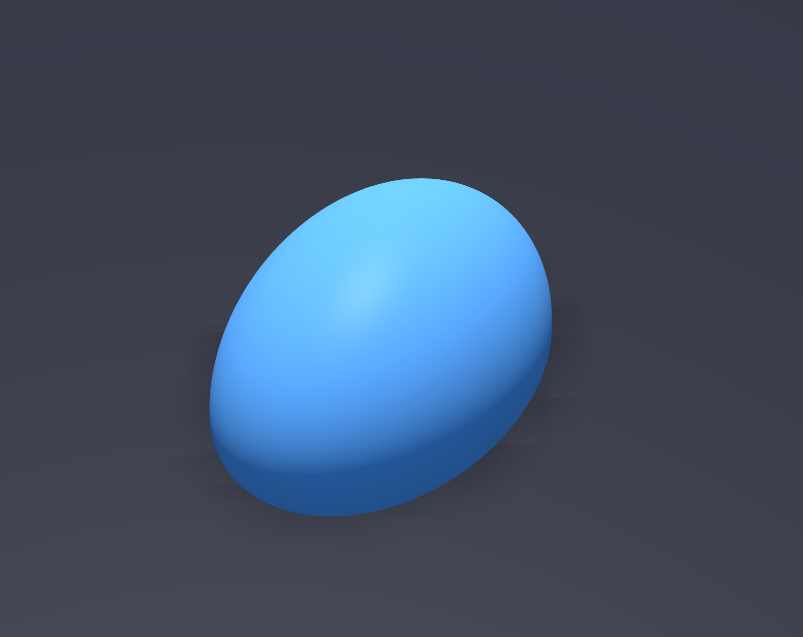

# Manipulation Objects

## Overview

This package contains USD assets used for manipulation in Newton.

| Object | Folder | Description | Source |
|--------|--------|-------------|--------|
| Cup | `cup/` | A simple cup mesh | Custom modelled |
| Gripper Pad | `pad/` | A pad mesh for gripper fingers | Custom modelled |

## Gallery

| Cup | Gripper Pad |
|-----|-------------|
|  |  |

## Changelog

For changes made to the models, please refer to the Git commit history of this folder.

## License

For model licensing, please refer to the specific subfolders.
